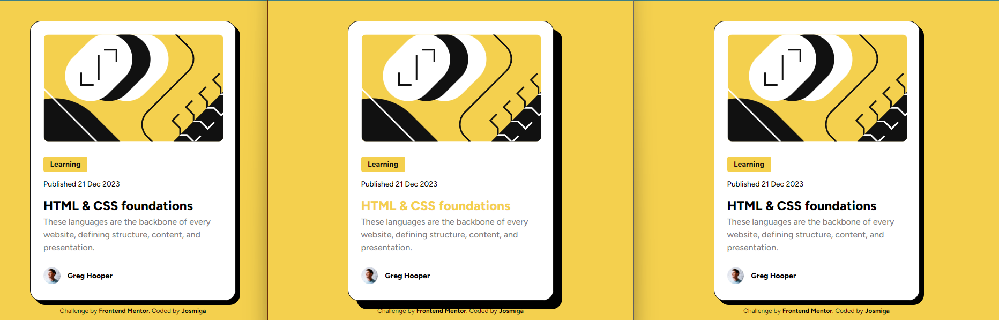

# Frontend Mentor - Blog preview card

This is a solution to the [Blog preview card challenge on Frontend Mentor](https://www.frontendmentor.io/challenges/blog-preview-card-ckPaj01IcS). Frontend Mentor challenges help you improve your coding skills by building realistic projects. 

## Overview
### Screenshot

### Links
- Github Site URL: [Josmiga - Blog preview card](https://github.com/Josmiga/fm-preview-card)

## My process
### Built with
- Semantic HTML5 markup
- CSS custom properties
- Flexbox

## Author
- Frontend Mentor - [@Josmiga](https://www.frontendmentor.io/profile/Josmiga)
- Twitter - [@josmigga](https://www.twitter.com/josmigga)